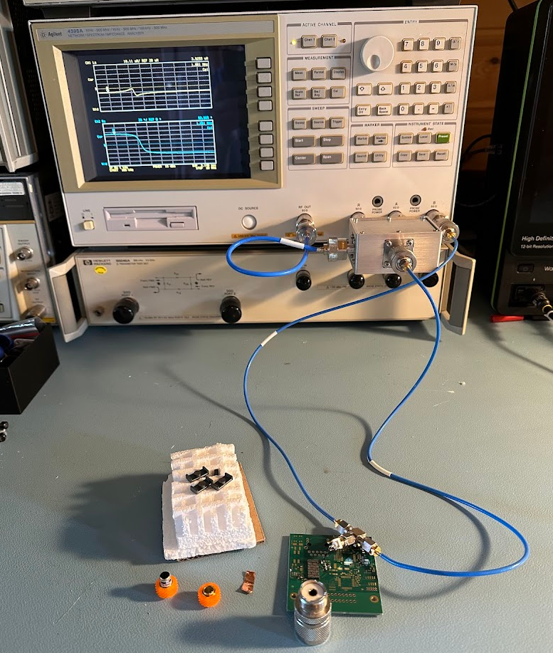
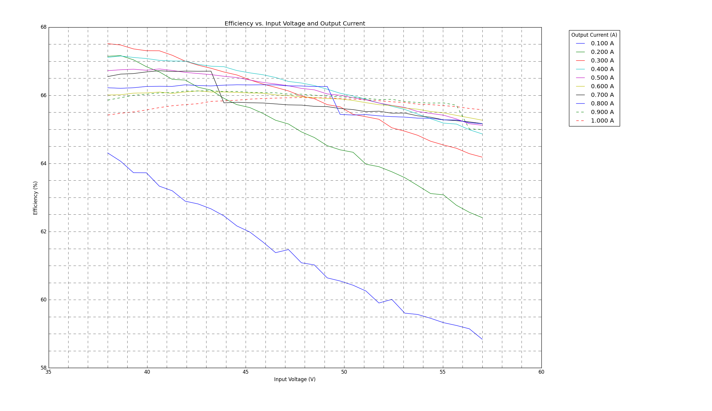
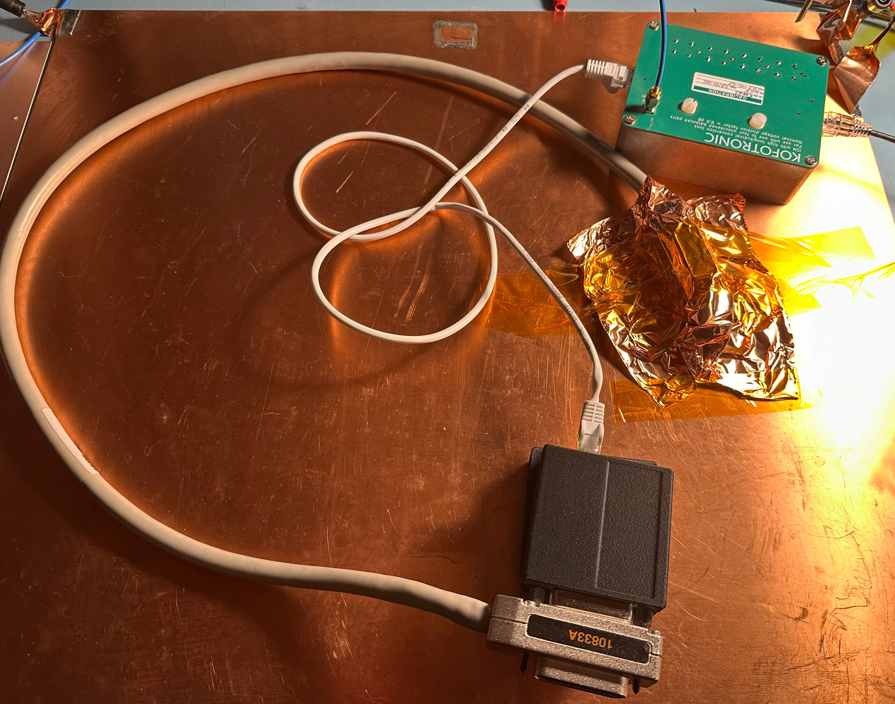
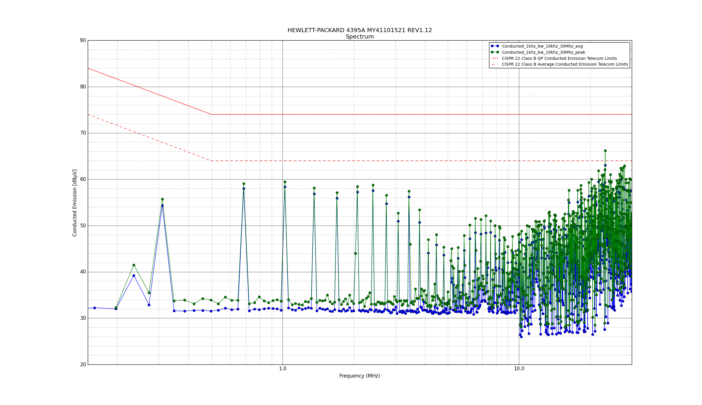
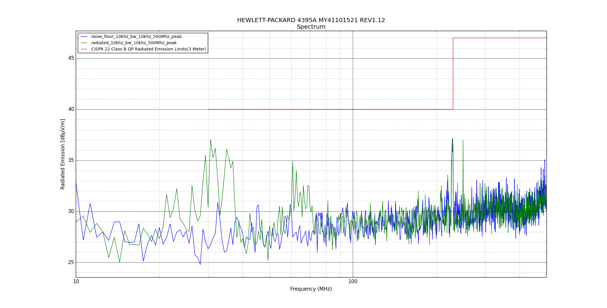
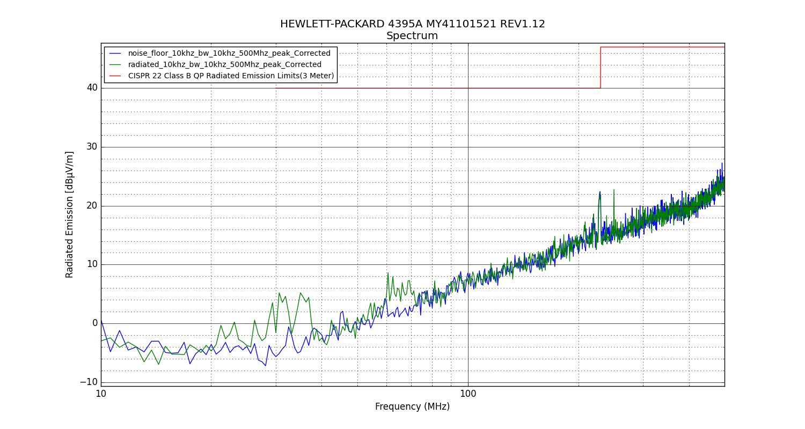
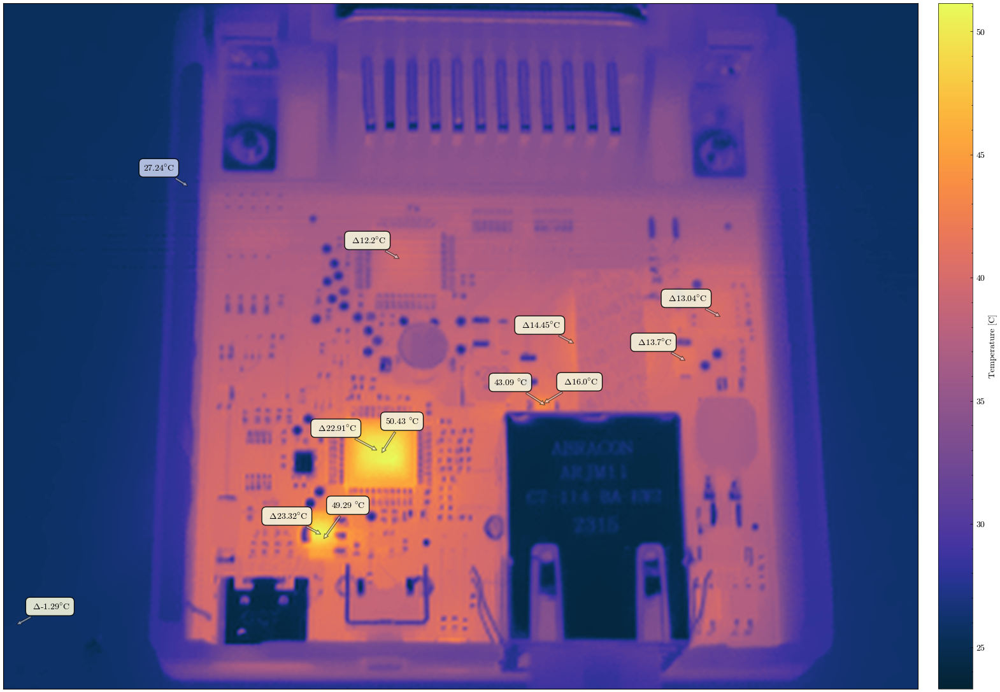

# PoE Ethernet GPIB Adapter

## Design Tests

---

## Scope of Testing

Each of the main blocks of the adapter was fully design-tested. The prototype (shown in the header image) was built in stages to facilitate testing each module as it was brought up.

The adapter was built and tested in this order:

- PoE Power Supply
- Microcontroller Interface
- USB Interface
- Network Interface
- GPIB Interface

**Note:** While there are screenshots and CSV files of many measurements in this repository, I decided against including them here since they are of limited interest unless you're deeply involved in the testing. If you wish to review them, the files in the `DT/Figs` folder should be self-explanatory.

---

## Electrical Testing

### PoE Transformer

First, a bare PCB was modified to characterize the transformer using an HP4395A impedance analyzer in shunt-thru mode.

**Test Setup:**  

Measurements included primary/secondary inductance, leakage inductance, and interwinding capacitance. The system was fully calibrated, and fixture parasitics were compensated.

Results for a 50nH core combination:

- Interwinding capacitance: **100 pF**
- Primary inductance: **18.2 µH**
- Secondary inductance: **2.29 µH**
- Primary leakage inductance: **395 nH**

These results matched expectations based on the transformer design.

### PoE Flyback 5V Power Supply

The flyback controller was fully populated, and the DUT was connected to a lab power supply with current limiting. The power supply came alive at ~36.5V input, providing a stable 5.01–4.9V output under load.

**Test Setup:**  

**Challenges Encountered:**  
At ~48V input, the power supply misbehaved due to an insufficient air gap in the transformer core. This was addressed by replacing one core half with a gapped one, reducing the Al value to 50nH. While this increased magnetizing current and reduced efficiency, it was an acceptable trade-off given the low power consumption of the adapter.

**Observations:**  
- The zener snubber on the switching node worked well; no RC snubber was required.
- A 330pF + 33Ω snubber was added across the rectifier diode to mitigate high-frequency ringing.
- Efficiency measurements confirmed expected behavior, with results influenced by the lower inductance core.

**Efficiency Plot (Clickable):**  

Thermal testing showed no concerning hotspots under typical load conditions.

### Microcontroller Interface

The microcontroller and supported circuitry were populated. The device was successfully programmed via JTAG and blinked all LEDs as expected—no issues detected.

### USB Interface

The CH340X USB interface was populated and tested. It was detected by the computer, the serial console worked as expected, and the reset line behaved correctly for USB programming. No ringing or anomalies were observed on any I/O lines.

### Network Interface

Populating the Wiznet W5500 revealed a 4.2V output on the 3.3V LDO, caused by an ordering mistake. Replacing the incorrect LDO resolved the issue, and the power supply measured a proper 3.303V.

With the adapter code loaded, the W5500 successfully connected to the network and obtained an IP address. Signal integrity on all I/O lines was checked with an oscilloscope—no issues were found.

### GPIB Interface

Connecting the adapter to a GPIB-equipped instrument and querying `*IDN?` returned the instrument's ID successfully. The adapter performed well in a multi-instrument setup with no communication or signal integrity issues.

---

## EMC Compliance Testing

**Disclaimer:** This testing was conducted in a home lab with DIY equipment. While reasonably characterized, these results are not guaranteed to meet professional testing standards.

### Conducted Emissions

**Test Setup:**  

**Results (Clickable):**  

The adapter met CISPR-22 Class B standards based on the setup, although margins were tight on the high-frequency end. No additional tweaks were deemed necessary.

### Radiated Emissions

A TEM cell was used to approximate far-field measurements. While not perfect, it provided useful insights.

**Uncorrected Results (Clickable):**  

**Corrected Results (Clickable):**  

No major issues were observed, and no further measures were necessary.

---

## Thermal Testing

Thermal testing showed the adapter housing raises internal temperatures by ~10°C above ambient. Thermal imaging identified the 3.3V LDO and Ethernet interface as the hottest components (~23°C above ambient).

**Thermal Plot (Clickable):**  

The adapter is suitable for operation at ambient temperatures up to 50°C.

---

## Conclusion

The device meets or exceeds all design goals. Improvements made for the release version include:

- Adding optional I2C and UART2 to the JTAG connector.
- Enhancing copper pours for the Ethernet controller and LDO (though primarily a bonus).

Overall, the design has proven reliable and robust.

